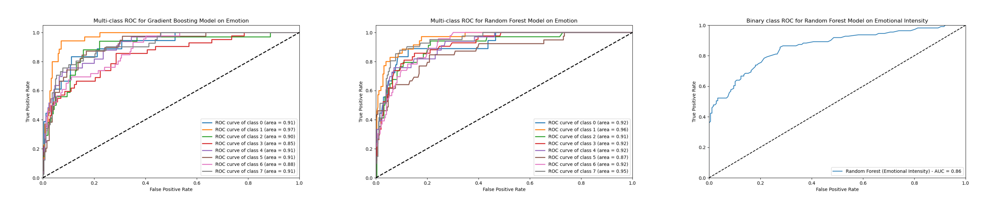

# 📊 MoodMiners-Project-Proposal

[Full Project Report](https://docs.google.com/document/d/1cpSbR_xyYgJtLfv-9f3B5DH_xixvS6YQsjz4ynyA8y8/edit?usp=sharing)

The sentiment analysis project involves creating a system that analyzes emotions from audio files in .wav format. The system takes into account several features that define the context and content of the audio sample.

The final assessment Area under the Curve (Reciever-Operating Characteristic Curves) for the models look like so:

## ROC Curves

## Confusion Matrix Metrics

